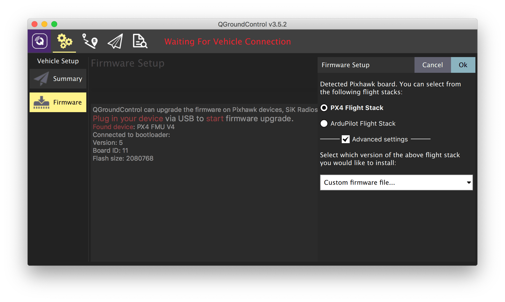
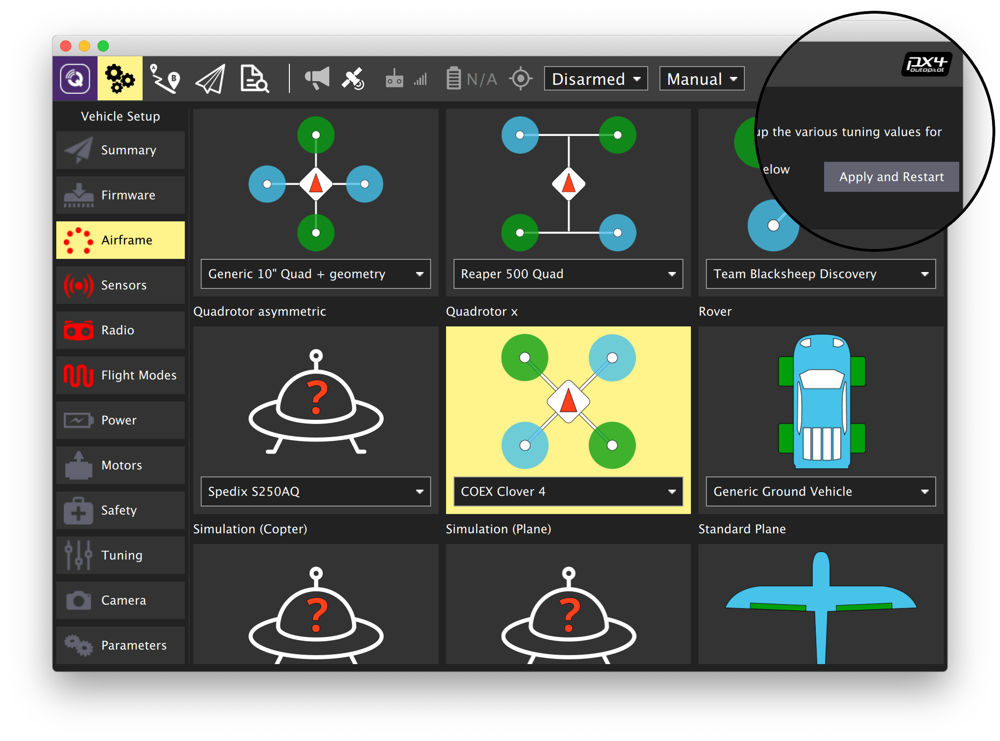

# Deckblatt

## Drohnenbau

### Von Max, Jakob, Marko, Nick und Nikita

# Inhaltsverzeichnis

# Anleitung

[Frame Assembly](#frame-assembly)

## <a href="https://clover.coex.tech/en/assemble_4_2.html">Zusammenbau</a>

⚠️Der Zusammenbau soll nur darauf hinweisen welches die wichtigsten Schritte sind! Die <a href="https://clover.coex.tech/en/assemble_4_2.html">Coex Anleitung</a> sollte immer als Referenz genutzt werden.⚠️

### <a href="https://clover.coex.tech/en/assemble_4_2.html#frame-assembly">Frame Assembly</a>

Der Frame Ist aus Carbon und wird mit den mitgelieferten Schrauben und Muttern zusammengebaut. Dabei wird ein wenig Kraft benötigt, da die vorgefertigten Löcher im Frame relativ eng sind.

### <a href="https://clover.coex.tech/en/assemble_4_2.html#installing-motors    ">Motor Install</a>

Beim installieren der Motoren muss besonders darauf geachtet werden, dass die motoren in der richtigen Reihenfolge und Richtung eingebaut werden (siehe Abbildung) und die 5mm Schrauben verwendet werden damit die Schrauben nicht die Windungen der Motoren benötigt werden.<br>


### <a href="https://clover.coex.tech/en/assemble_4_2.html#installing-esc-and-pdb">Installing ESC (Speed Controller) and PDB (Power Distribution Board)</a>

Dabei die ESCs mit den mitgelieferten Kabelbindern am Frame befestigen und die Kabel zu den Motoren sicher zusammenstecken. Das PDB mit dem Batterie Kabel nach hinten befestigen. Die Kabel der ESCs mit dem PDB verbinden.<br>


### <a href="https://clover.coex.tech/en/assemble_4_2.html#installing-flight-controller">Installing Flight Controller</a>

Den Flight Controller mit den mitgelieferten nylon Muttern auf das PDB schrauben.<br>


### <a href="https://clover.coex.tech/en/assemble_4_2.html#connect-flight-controller">Connect Flight Controller</a>

Die Motoren mit dem Flightcontroller verbinden (siehe Abbildung).<br>

<br>
Den Fligthcontroller mit dem PDB verbinden (mit einem der mitgelieferten 6-pin Kabel) (siehe Abbildung).<br>


### <a href="https://clover.coex.tech/en/assemble_4_2.html#installing-raspberry-pi">Installing Raspberry Pi</a>

Bei dem Aufstecken des Raspberry Pi muss darauf geachtet werden, dass die Schraubenlöcher nicht perfekt passen und an dem Pi etwas material abgeschliffen werden muss. Die Schrauben sollten nicht zu fest angezogen werden, da sonst der Pi beschädigt werden kann.<br>

<br>
Der Reciever muss mit dem roten doppelseitigen Klebeband auf das Plexiglas gekebt werden. Der Deckel der Kamera kann an dieser Stelle bereits abgenommen werden, da dieser später schwieriger zu erreichen ist. Das Flex Kabel der Kamera muss nun mitt der richtigen seite in den Raspberry Pi gesteckt werden.

### <a href="https://clover.coex.tech/en/assemble_4_2.html#installing-led-strip-and-legs">Installing LED Strip and Legs</a>

Der Plastik Streifen auf dem der LED-Strip installiert wird muss sehr stark gebogen werden. Dafür wird einige kraft benötigt, das brechen ist jedoch nur schwer möglich. Der rest erfolgt nach der Anleitung.

### <a href="https://clover.coex.tech/en/assemble_4_2.html#installing-guard">Installing Guard</a>

Der Guard muss der Anleitung nach installiert werden.

### <a href="https://clover.coex.tech/en/assemble_4_2.html#flight-preparation">Flight Preparation</a>

Die Flight Preparation muss der Anleitung nach erfolgen.

## <a href="https://clover.coex.tech/en/setup.html#initial-setup">Initial setup</a>

### <a href="https://clover.coex.tech/en/setup.html#installing-qgroundcontrol">Installing QGroundControl</a>

QgroundControl ist ein Programm mit dem man den Flight Controller flashen, konfigurieren und kalibrieren kann.


Lade dir das Programm <a href="https://docs.qgroundcontrol.com/en/getting_started/download_and_install.html">auf der offiziellen Website</a> herunter und installiere es.

### <a href="https://clover.coex.tech/en/setup.html#preparing-the-microsd-card">Preparing the MicroSD card</a>

Die MicroSD Karte des Flight Controllers muss mit FAT32 formatiert werden.

### <a href="https://clover.coex.tech/en/setup.html#flashing-the-flight-controller">Flashing the Flight Controller</a>

Um den Flight Controller zu flashen, schließe den Flight Controller über USB an den PC an. Starte QGroundControl und klicke das icon links oben an. Wähle "**Vehicle Setup**" aus und klicke anschließend auf den "**Firmware**" Tab.



<br>Trenne den Flight Cotroller vom PC (wenn verbunden) und schließe diesen nochmal an. Wähle in dem neuen Menü "**PX4 Flight Stack**" aus.
Setze einen Haken bei "**Advanced Settings**" und wähle "**Custom firmware file...**" aus. Wähle nun die Firmware aus, die du heruntergeladen hast.

### <a href="https://clover.coex.tech/en/setup.html#configuring-the-flight-controller">Configuring the Flight Controller</a>

Die Einstellungen sehen so aus:


Parameter die eingestellt werden müssen: Airframe, Radio, Sensoren, Flight Modes.

### <a href="https://clover.coex.tech/en/setup.html#selecting-the-airframe">Selecting the airframe</a>



1. Öffnet das Airframe Menü.
2. Wähle den "**Quadrotor X**" airframe aus.
3. Wähle "**COEX Clover 4**" aus dem dropdown menü aus. Ansonsten wähle "**Generic Quadrotor X**" aus.
4. Starte den Flight Controller in der rechten oberen Ecke neu bevor andere Einstellungen verändert werden.

### <a href="https://clover.coex.tech/en/setup.html#setting-parameters">Setting parameters</a>

1. Öffne das "**Parameters**" Menü.
2. Suche nach den Jeweiligen parametern und ändere diese wie in der Tabelle angegeben. Dies sind Durchschnittswerte und sollten für jede Drohne individuell eingestellt werden.

```
- MC_PITCHRATE_P = 0.087
- MC_PITCHRATE_I = 0.037
- MC_PITCHRATE_D = 0.0044
- MC_PITCH_P = 8.5
- MC_ROLLRATE_P = 0.087
- MC_ROLLRATE_I = 0.037
- MC_ROLLRATE_D = 0.0044
- MC_ROLL_P = 8.5
- MPC_XY_VEL_P = 0.11
- MPC_XY_VEL_D = 0.013
- MPC_XY_P = 1.1
- MPC_Z_VEL_P = 0.24
- MPC_Z_P = 1.2
```

### <a href="https://clover.coex.tech/en/setup.html#circuit-breaker-parameters">Circuit breaker parameters</a>

1. Setze den "**CBRK_USB_CHK**" Parameter auf **_197848_** um Flüge mit der USB Verbindung zu ermöglichen.
2. Deaktiviere den Safety Switch Check: "**CBRK_IO_SAFETY**" = **_22027_**.
