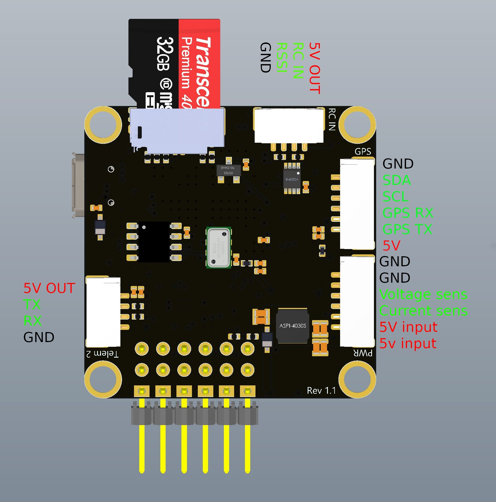
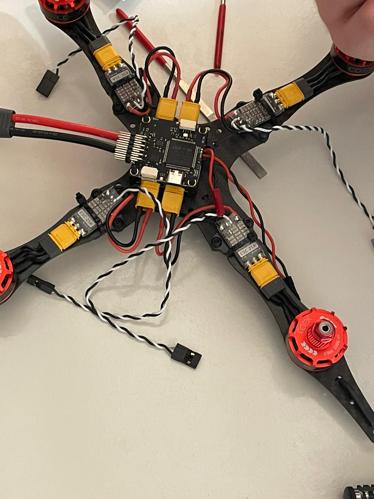
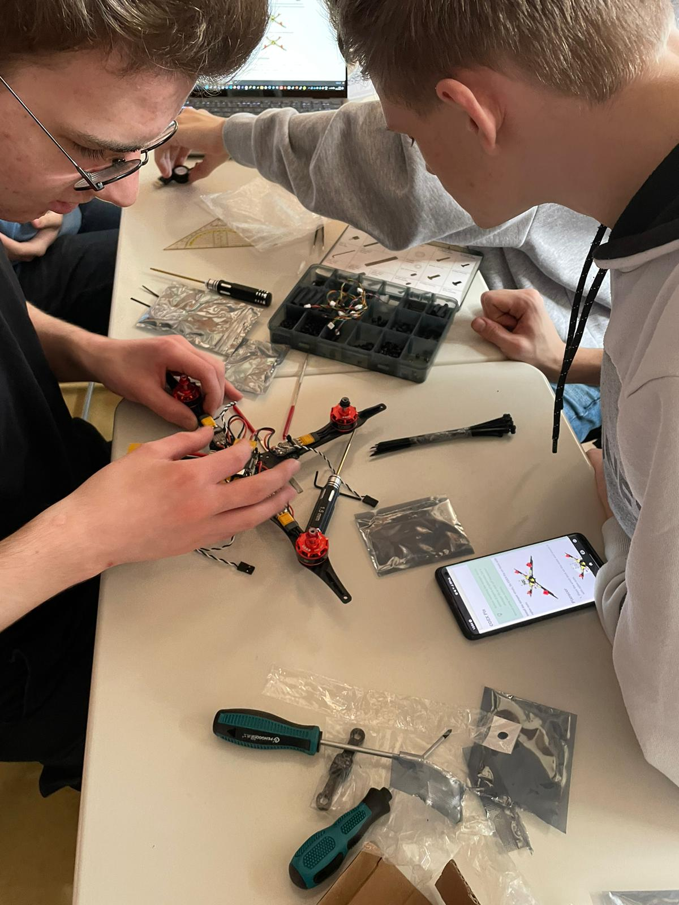

# Zusammenbau

## Tag 1

Heute haben wir uns mit der Anleitung vertraut gemacht und mit dem Bau der Drohne begonnen. Nikita und Marko haben sich mit der Anleitung beschäftigt wärend Max, Nick und Jakob an der Drohne gebaut haben.

Eingebaute Teile:

- Carbon Frame
- Motors
- Speed Controller ( ESC )
- Power Distribution Board ( PDB )
- Flight Controller ( <a href=https://clover.coex.tech/en/coex_pix.html>COEX Pix Pinout</a> )

  ### Pinout:

 

Zusatzinformationen: 

- Die Motoren wurden mit den ESCs verbunden. 
- Die ESCs wurden mit dem PDB verbunden und befestigt.

### Bilder

 

## Tag 2-3

Bau der Drohne wurde fortgesetzt.
Das Raspberry Pi Image wurde von Max und Marko auf die SD-Karte geflasht und in den Pi eingesetzt.
Softwareupdate (apt update/upgrade) wurde durchgeführt.
Der Flight-controller wurde zudem auch von Nick und Jakob geflasht, jedoch musste noch die richtige Config geflasht werden, welche die richtigern Parameter beinhaltet. Diese ist auf der <a href="https://github.com/CopterExpress/Firmware/releases/download/v1.8.2-clover.13/px4fmu-v4_default.px4">COEX Website</a> zu finden.
Der Rpi hat nicht in der Reihenfolge draufgepasst, ohne die löcher größer zu feilen, daher haben wir die Reihenfolge des Einbaus der Komponenten geändert. Die RC zeigt die Batterie der Drohne nicht wie auf der Website gezeigt an.

Eingebaute Teile:

- Flight Controller
- Raspberry Pi
- Radio Receiver

Zusatzinformationen: 
Der Flight-controller wurde an den Strom angeschlossen und kurz angeschaltet. 
Der Receiver wurde an das "Mounting Deck" geklebt.

## Tag 4

Jakob und Max haben versucht die Drohne zur Fernbedienung zu verbinden aber ohne Erfolg. Die Drohne hat eine Verbindung zur RC jedoch weden die Channel nicht angezeigt bzw. die Drohne reagiert nicht auf die RC.
Motortest nicht möglich, da "Command nicht in Software vorhanden". Die Firmware ist oft nicht richtig geflasht worden.

Eingebaute Teile:

- GPS Modul

Zusatzinformationen: 
GPS Modul noch nicht fest eingebaut, da keine vorgegebene stelle an der Drohne vorhanden war.

## Tag 5

Gegen Ende der Stunde haben wir es geschafft endlich die Motoren drehen zu lassen, dabei durften wir zusehen wie Justin die Motoren seiner Gruppe gegrillt hat, da er statt 5mm Schrauben, 8mm Schrauben verwendet hatte welche die Spulen des Motors berührten und einen Kurzschluss verursacht haben. Wir haben die SD-Karte des Flight Controllers neu formatiert und dann die original <a href="https://github.com/CopterExpress/Firmware/releases/download/v1.8.2-clover.13/px4fmu-v4_default.px4">[PX4 Firmware v1.8.2-clover-13 v4]</a> draufgeflasht. Die SD-Karte des Flightcontrollers ist nicht für den "Manual Flight" Relevant, da darauf nur Logs und Missionsdaten gespeichert werden. Nick hat dabei die Drohne erneut auf einbaqufehler untersucht.

Eingebaute Teile: -

Zusatzinformationen: 
Motoren drehen sich, da Max die Firmware neu geflasht wurde und Jakob einige parameter verändert hat.

## Tag 6

Wir bauen das GPS Modul ohne Anleitung drauf (da es nicht in der Anleitung vorhanden ist). Wir positionieren es oben über dem Flight Controller.

[ ACHTUNG ] Es ist wenig platz zwischen dem GPS-Modul und der Batterie. GPS tracking mag nicht Perfekt sein. Interference kann durch die Metallplatten an der Batterie ein möglicher verursacher des Problems sein ("Drift").

## Tag 7-8

Nikita und Marko haben die Propeller oben draufgebaut und festgezogen. Wir haben hauptächlich anderen Gruppen geholfen und uns genauer in die Dokumentation vertieft. Der Erste Flugversuch gelingt mit relativ starkem "Drift" welcher gut mit der Kalibrierung der RC gegensteuerbar war. Mögliche urachen für den "Drift" sind:

- (Wind)
- GPS Modul
- Schlechte Kalibrierung des Flight Controllers/Gyroskops

[ ACHTUNG ]

- Die Propeller richtig herum draufschrauben (Erspart viele Kopfschmerzen).
- Bei jedem Test ohne Flugversuch die Propeller abnehmen (erspart zwei BG Rechnungen).

[ TIPP ] Die Drohne nochmal neu kalibrieren wenn diese komisch fliegt.

Eingebaute Teile:

- Propeller

Zusatzinformationen: -

## Tag X der Tag der Verdammnis

Die Batterie der Drohne ist vollkommen unverständlich, die Zellen können Tiefentladen sein und daher nichtmehr von dem Ladegerät erkannt werden. Das Ladegerät lädt bei den defekten Batterien nur noch bis 12,6 Volt. 3 Batterien sind Scheinbar Kaputt. Die Zelle 4 hat 0 Volt (mehrere male gemessen) und keinen Wiederstand (Kurzschluss). Wir haben eine Batterie aufgeschnitten und die defekte Zelle abgelötet. Nach dem Anlöten der neuen Zelle und der erneuten Kalibrierung der Drohne Funktioniert die modifizierte Batterie normal jedoch mit 25% verringerter Kapazität. (Nur noch drei Zellen)
Außerdem sinken die berechneten Batterie-Prozente der Batterie im Flug extrem Schnell und Steigen nach Landung erneut rasant. Die Drohne fliegt aber trotzdem normal, meckert jedoch über die Batterie Ladung. (Die Drohne nutzt vielleicht zu viel Ampere?)

Bei dem Versuch eine deferkte batterie (0V Zelle) zu verwenden hat sich die eine Batterie deutlich aufgebläht. Die Batterie ist nicht mehr zu gebrauchen. Der Flug lief jedoch kurzzeitig reibungslos.

Bei einem Kalibrierungsversuch der Drohne geriet uns diese außer Kontrolle und hat dabei Max und Jakob leicht verletzt. Die Drohne hat deutlich mehr Power gehabt als alle anderen zuvor und hat die Batterie nicht richtig erkannt. Dabei ist die Batterie kaputt gegangen, da die Rotoren die Balancing-Connector Kabel zerrschnitten haben. Die Drohne hat dabei aber keinen größeren Schaden genommen. Wir sind uns nicht sicher ob ein Hardware defekt vorliegt, vermuten es aber (Power Distribution Board vielleicht beschädigt).

## Zwischenarbeit 1

Experimentieren mit GPS und Verbindungsmöglichkeiten der Drohne. Die Drohne hebt nicht ab wenn eine Mission gestartet wird, da die Posotion der Drohne nicht genau genug ist. Außerdem "Driftet" das GPS stark. Warum das GPS-Modul einen USB-micro-Port hat ist uns nicht klar. Wir haben es mit dem USB-Port des Rpi Verbunden und mit I2C und UART mit dem Flightcontroller. Auf der <a href="https://clover.coex.tech/en/coex_gps.html">Website</a> ist über das GPS-Modul nicht viel zu finden. 
 
[ TIPP ] Das GPS braucht ein paar Minuten um die Satelliten zu finden und eine Verbindung aufzubauen.
Das GPS funktioniert nur draußen, am besten mit freier Sicht auf den Himmel.

Eingebaute Teile: -

Zusatzinformationen: -

## Hilfe und Probleme bei anderen Gruppen

Bei Justins Gruppe wurden in der qGroundControl app die Channel der RC nicht angezeigt. Wir haben ihnen geholfen die RC neu zu "<a href="https://clover.coex.tech/en/rc_flysky_a8s.html#rc_bind">Binden</a>" da dies nicht von Werk aus gemacht wurde.
Dazu muss man beim Start des Recievers den Bind Knopf drücken und dann die RC einschalten. Danach sollte die RC mit der Drohne verbunden sein.

Sebis Gruppe hatte eine verbundene RC, jedoch wurden die Channel trotzdem nicht angezeigt. Dagegen muss man den <a href="https://clover.coex.tech/en/rc_flysky_a8s.html#changing-the-receiver-mode-sbusi-bus">Knopf am Reciever für 2 Sekunden Drücken</a>. Danach sollten die Channel in der Software angezeigt werden.
Außerdem Reagiert die Drohne nur ser verzögert auf die RC und das auf nahezu zufälligem wege. Warum dies so ist, ist uns nicht klar.
Auch wackelt die Drohne sehr suspiziös wenn sich die Motoren drehen. Wir sind uns nicht sicher ob dies ein Hardware oder Software Problem ist.

# WICHTIGE INFORMATIONEN ⚠️

- ⚠️ Batterien nicht zu sehr entladen ⚠️, da diese sonst unbrauchbar werden (max 16,8V (vollgeladen) - min 14,8V)(Pro Zelle: min 4.2V (vollgeladen) - min 3.5V).
- Den Motortest nur ohne Propeller durchführen da Verletzungen entstehen könnten sowie Schäden an der Drohne und anderen Gegenständen.

---

# References

Links:

- <a href=https://clover.coex.tech/en/assemble_4_2.html>Anleitung</a> (Gitbook)
- <a href=https://github.com/CopterExpress/clover>Clover Github</a>
- <a href=https://github.com/CopterExpress/Firmware/releases/download/v1.8.2-clover.13/px4fmu-v4_default.px4>Flight Controller Firmware</a>
- Drone WI-FI SSID: "clover-5548"
- Drone WI-FI PW: "cloverwifi"
- Wi-Fi Gateway / PI-IP: <a href=http://192.168.11.1>192.168.11.1</a>
- LAN: <a href=http://192.168.137.177>192.168.137.177</a>

# (Ziel: Drohne soll so aussehen)

